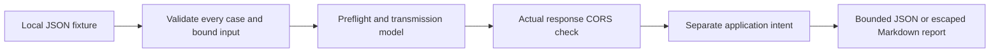

# CORS Preflight Policy Lab

An offline Python teaching model that separately reports request transmission, browser
response visibility and a fictional application's intended origin policy. It makes no
network requests and performs no server effects. **This is a restricted model, not a
browser-conformance suite or production CORS scanner.**

The 32 frozen scenarios include public wildcard reads, exact credentialed origins,
readable403/404 responses, denied preflights, broad origin reflection, serialized null,
Authorization/wildcard boundaries and a safelisted POST whose modeled effect occurs even
though script cannot read the response. Thirty are supported; two are explicitly unknown.

## Run

Python3.11+; verified Python3.13.7 on Windows. No runtime dependency or installation.
From this directory:

```powershell
python -m corslab
python -m corslab --format markdown --output reports/my-demo.md
python -m corslab fixtures/cases.json --output reports/my-demo.json
python -m unittest discover -s tests -v
python -O -m unittest discover -s tests -v
```

Exit0: all cases supported. Exit2: complete valid report contains unsupported cases.
Exit3: invalid input or local I/O/output failure. The default fixture intentionally exits2;
that does not mean a failed test. Supported denial is a modeled result, not a CLI error.
Output files must be fresh. Input/labels are not overwritten. Rare local write failures
can leave a partial newly created report; exit3 means it must not be accepted as evidence.

Complete recorded demo: [Markdown](reports/verification/demo.md) and
[JSON](reports/verification/demo.json). [Verification](docs/verification.md) records
21 passing tests, normal/optimized execution, Bandit and two detected mutations.

## How it works



- `corslab/contracts.py`: strict JSON, canonical restricted origins, header/status schemas.
- `corslab/model.py`: pure CORS/preflight reasoning; no expected-label imports or I/O.
- `corslab/__main__.py`: bounded file reading, all-or-nothing validation, report creation.
- `fixtures/cases.json` and `expected.json`: separately frozen data and source-reasoned labels.
- `tools/verify.py`: repeat checks/mutations into a fresh evidence directory, restoring source.

Response sharing is not server authentication/authorization. A failed response check
cannot undo a request already sent. Cookie attachment, server processing and CSRF
defenses are not inferred; `effect_if_sent` is an explicit fictional fixture assumption.
The trusted-origin list represents private application intent. A public wildcard can
be a valid protocol control while outside that private list; these are separate fields.

## Model boundaries

All transactions are declared cross-origin and mode=cors, with empty preflight cache.
Only canonical HTTP(S) lowercase ASCII DNS origins and the literal opaque marker `null`
are supported. No DNS resolution occurs. Default ports must be omitted; userinfo,
path/query/fragment, uppercase/empty labels and ambiguous ports are rejected. Numeric
hosts, IPv6 and Unicode origins have explicit unsupported results; policy allowlists
must contain supported non-null origins. Serialized null is not a trusted identity.

Methods: GET/HEAD/POST/PUT/DELETE. Request headers: Content-Type with three exact safelisted
values (text/plain, application/x-www-form-urlencoded, multipart/form-data), application/json,
Authorization and x-test. Parameters, Range, Accept-Language and other browser header
rules are unsupported. Actual informational/redirect statuses and unnecessary supplied
preflight responses are unsupported. Actual403/404/500 can be exposed; preflight requires2xx.

No redirects, service workers, no-cors/navigation, preflight cache, private-network rules,
cookie store, full URL algorithm, live websites, API/service or production setting changes.
Passing tests establishes modeled behavior only. See [contract](docs/contracts.md),
[security model](SECURITY.md), [plan/research](tasks/plan.md) and [state](STATE.md).

## Reproduce and learn

With Bandit already installed:

```powershell
python tools/verify.py reports/FRESH_VERIFICATION_DIRECTORY
```

The helper captures exact commands/statuses and source/fixture SHA-256 hashes. It does
not install packages, use inference or execute fixture text. It temporarily weakens
owned source twice and restores exact bytes in finally; run with no concurrent project
editor. The hashes distinguish frozen evidence from later changes.

Learning exercise: compare `post-sent-unreadable` and `put-denied`. Why does the first
model an effect while the second does not? Which separate server-side control is still
needed even when CORS denies reading?

## Attribution and AI assistance

Original implementation/fixtures by Jake with Codex assistance; MIT license. Source
references include WHATWG Fetch/HTML/URL, MDN, OWASP, django-cors-headers (MIT) and WPT
(BSD-3-Clause). No upstream implementation or test code was copied. Source links/blob
SHAs and retrieval limits are in `research/source-record.json` and the plan.
Local Ollama produced a rejected draft of test ideas; raw evidence is retained. Codex
performed source/security review and implementation. ECC review is an implementing-agent
self-review, not independent assurance. No remote inference or paid capacity was used
for this successor. No publication, remote repository or browser evaluation performed.

## Publication status

See [publication review](PUBLICATION.md) for the October 5 source snapshot, fresh local checks, evidence boundaries and current hosted-check distinction.
